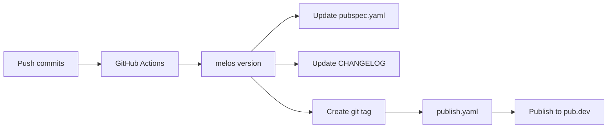

# Release Guide

How to release new versions of `sznm_dart_packages`.

## Overview

This project uses **automated releases** with GitHub Actions and Melos. Releases are triggered by conventional commit messages.

## Automated Release Flow



## Step-by-Step Guide

### Option 1: Automated (Recommended)

#### 1. Commit with Conventional Commits

```bash
git add .
git commit -m "feat: add new lint rule"
git push origin main
```

#### 2. GitHub Actions Handles the Rest

The `release.yaml` workflow automatically:
- ✅ Runs `melos version`
- ✅ Updates `pubspec.yaml` version
- ✅ Updates `CHANGELOG.md`
- ✅ Creates git tag (`sznm_lints-v2.0.1`)
- ✅ Creates GitHub release

#### 3. Automatic Publishing

The `publish.yaml` workflow:
- ✅ Detects new tag
- ✅ Runs verification
- ✅ Publishes to pub.dev

**Done!** Your package is published.

### Option 2: Manual Release

#### 1. Verify Changes

```bash
# Run verification
./scripts/verify.sh

# Check what would change
dart --disable-dart-dev pub global run melos version \
  --no-git-commit-version \
  --no-git-tag-version
```

#### 2. Create Release

```bash
# Create version commit
dart --disable-dart-dev pub global run melos version --yes

# Review changes
git status
git diff
```

#### 3. Push Changes

```bash
git push origin main --tags
```

#### 4. Publish to pub.dev

```bash
# Dry-run first
cd packages/sznm_lints
fvm dart pub publish --dry-run

# Actually publish
fvm dart pub publish
```

## Version Numbers

### Automatic Versioning

Melos determines version bumps from commit messages:

| Commit Type | Bump | Example |
|-------------|------|---------|
| `feat:` | Minor | 2.0.0 → 2.1.0 |
| `fix:` | Patch | 2.0.0 → 2.0.1 |
| `feat!:` or `BREAKING CHANGE` | Major | 2.0.0 → 3.0.0 |

### Manual Override

```bash
# Specify bump type
dart --disable-dart-dev pub global run melos version sznm_lints:minor

# Specify exact version
dart --disable-dart-dev pub global run melos version sznm_lints:2.1.0
```

## CHANGELOG

### Automatic Generation

Melos automatically generates CHANGELOG entries from commit messages:

```md
## 2.1.0

 - **FEAT**: add new lint rule. ([abc123](commit-url))
 - **FIX**: correct rule configuration. ([def456](commit-url))
```

### Manual Edits

You can manually edit `CHANGELOG.md` if needed:

```md
## 2.1.0

 - **FEAT**: add new lint rule.
 - **DOCS**: update usage guide.
```

## GitHub Releases

### Automatic Creation

GitHub releases are automatically created from tags with:
- Release title: `Release sznm_lints-v2.0.1`
- Auto-generated notes from commits

### Manual Release

1. Go to GitHub Releases
2. Click "Create a new release"
3. Select tag
4. Add release notes
5. Publish

## Publishing to pub.dev

### Requirements

- pub.dev account with publishing permissions
- OIDC trusted publishing configured (for GitHub Actions)

### Configure Trusted Publishing

1. Go to https://pub.dev
2. Click your profile → "Publishing settings"
3. Under "Trusted publishing", add:
   - Repository: `github.com/agustinusnathaniel/sznm_dart_packages`
   - Workflow: `publish.yaml`

### Verify Publishing

```bash
# Test publish
fvm dart run melos run publish-dry-run

# Or direct
cd packages/sznm_lints
fvm dart pub publish --dry-run
```

## Post-Release Checklist

- [ ] Verify package on pub.dev
- [ ] Check GitHub release was created
- [ ] Update any dependent projects
- [ ] Announce release (if significant)

## Troubleshooting

### Release Workflow Fails

**Check:**
1. Conventional commit format is correct
2. All CI checks pass
3. Git credentials are configured

**Fix:**
```bash
# Manually run version
dart --disable-dart-dev pub global run melos version --yes

# Commit and push
git commit -m "chore(release): publish packages"
git push --tags
```

### Publish Fails

**Common issues:**

1. **Authentication error**
   ```bash
   # Login to pub.dev
   dart pub login
   ```

2. **Version already exists**
   ```bash
   # Bump version manually
   dart --disable-dart-dev pub global run melos version sznm_lints:2.0.2
   ```

3. **Validation errors**
   ```bash
   # Check what's wrong
   cd packages/sznm_lints
   fvm dart pub publish --dry-run
   ```

### CHANGELOG Not Updated

**Fix:**
```bash
# Regenerate CHANGELOG
dart --disable-dart-dev pub global run melos version \
  --changelog \
  --no-git-commit-version \
  --no-git-tag-version
```

## Release Schedule

### Recommended Cadence

- **Patch releases**: As needed for bug fixes
- **Minor releases**: When adding features
- **Major releases**: When making breaking changes

### Planning Releases

1. Check pending commits
2. Determine version bump needed
3. Ensure all tests pass
4. Update documentation
5. Run release

## Related Workflows

| Workflow | Trigger | Purpose |
|----------|---------|---------|
| `ci.yaml` | Push/PR | Run checks |
| `release.yaml` | Push to main | Create release |
| `publish.yaml` | Tag push | Publish to pub.dev |

## Next Steps

- [Development Guide](/guide/development)
- [Getting Started](/guide/getting-started)
- [View Packages](/packages/sznm_lints/)
